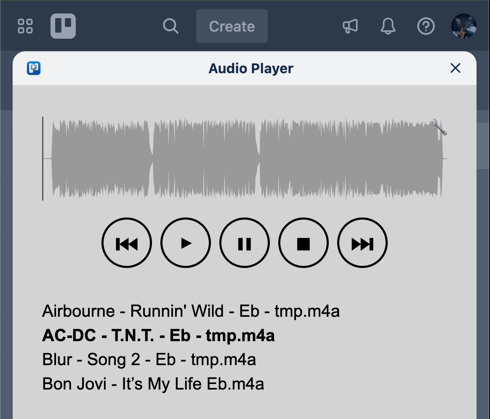

# Audio Player Power-Up for Trello

Audio Player Power-Up is a custom Trello Power-Up that plays audio attachments on a board list. Attachments ending in `.m4a` or `.mp3` are grouped into a playlist.  The Power-Up can also store a waveform for each attachment in Trello card storage so that the waveform can be displayed later.

The files in this repository are static and can be hosted on any static hosting provider.  GitHub Pages works well &mdash; fork https://github.com/vitar/trello-player/ repository and enable Pages to serve the files.

## Enabling the Power-Up in Trello
1. Open the [Trello Power-Up admin page](https://trello.com/power-ups/admin) and choose **New**.
2. Fill in the form:
   - **New Power-Up or Integration**: `Audio Player`
   - **Workspace**: choose your workspace
   - **Iframe connector URL**: the URL of `trello-player-power-up.html`
   - **Email**, **Support contact** and **Author**: your details
3. After creation open the Power-Up settings and configure:
   - **Icon**: link to `trello-player-192.png`
   - **Categories**: *Files management* and *Board utilities*
   - Enable **List actions** in **Capabilities**
   - Under **Privacy and compliance** set **Privacy URL** to the hosted `privacy.html` and answer **No** to storing Trello user personal data
4. Add the Power-Up to a board via **Power-Ups → Custom → Audio Player**.
5. In a board list open the list menu (`...`) and select **Audio Player**.

## Usage
- The popup displays all `.m4a` and `.mp3` attachments from cards in the list.
- Use **Previous** and **Next** to navigate the playlist while the audio player plays each attachment.
- Click the wrench next to the waveform area to create the waveform:
  1. Download the file.
  2. Load the downloaded file into the modal.
  3. Save the waveform back to Trello storage.

The Power-Up has been briefly tested in desktop and mobile Chrome.
_Trello mobile apps do not support custom Power-Ups._

## Known issues
- This Power-Up does not conform to Trello requirements and is not publicly listed, but it can be self-hosted and enabled in your workspace.

## License
The project is released under the [Unlicense](LICENSE).  Security issues can be reported by opening an issue in this repository as described in [SECURITY.md](SECURITY.md).

## Development
The project is being developed and maintained using OpenAI Codex with minimal manual intervention.

There're two repositories used for development and production purposes, each repository is hosted on separate GitHub Pages:
* https://github.com/vitar/trello-player-dev/ - for development (experimenting and testing).
* https://github.com/vitar/trello-player/ - for production.

When new features are developed, development repo code will be manually copied to production repo.
For fork purposes, use https://github.com/vitar/trello-player/ repository.

## Test automation
The `test` folder contains a small Node.js script that loads
`trello-player-power-up-popup.html` in a mock Trello environment using
[jsdom](https://github.com/jsdom/jsdom). The test reads the HTML from disk so it
always matches the current popup structure. Run `npm install` to fetch the test
dependency and then run `npm test` to execute `test/power-up-loading-test.js`,
which verifies that the Power-Up can load attachments when the Trello API is
mocked.

GitHub Actions can run this test automatically.  A workflow file is provided in
`.github/workflows/test.yml` that installs dependencies and runs `npm test` on
every push or pull request targeting `main`.
