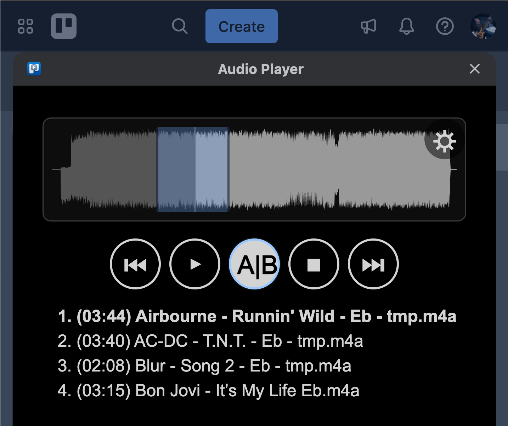
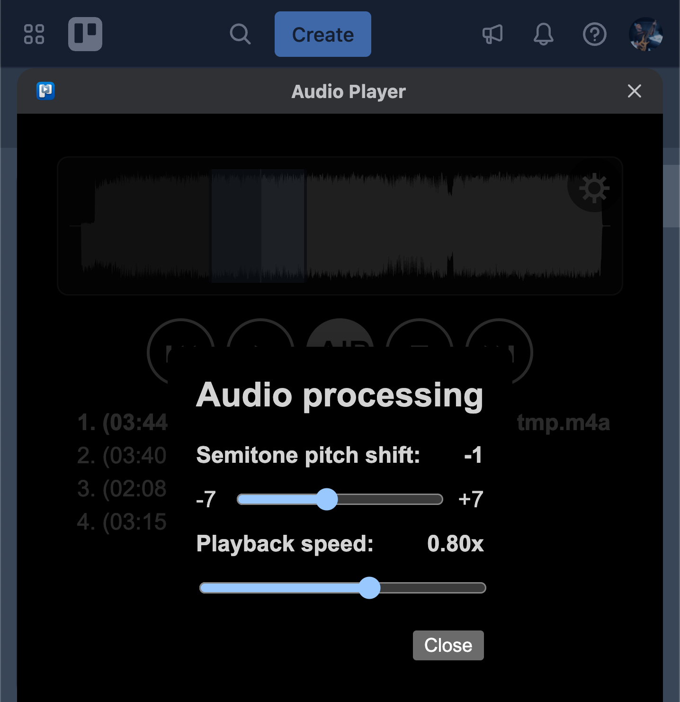

# Audio Player Power-Up for Trello

Audio Player Power-Up is a custom Trello Power-Up that plays audio attachments on a board list.

Uploaded attachments ending in `.m4a` or `.mp3` are grouped into a playlist.



The Power-Up display a waveform, allow to repeat a region, to shift pitch from -7 to +7 semitones, change playback speed from 0.5x to 1x.



The files in this repository are static and can be hosted on any static hosting provider.  GitHub Pages works well &mdash; fork https://github.com/vitar/trello-player/ repository and enable Pages to serve the files, choose **gh-pages** branch.

Power-up depends on CORS proxy (see **Proxy configuration** and **Cloudflare Worker deployment**).

## Repository structure
- `src/trello-power-up/` &mdash; HTML, CSS and JavaScript that power the Trello popup experience, including the `trello-player-config.js` bootstrap that exposes runtime configuration to the player.
- `src/cloudflare-worker-cors-proxy/` &mdash; Cloudflare Worker source used to provide CORS access to Trello attachments.
- `test/` &mdash; unit tests (Node's built-in `node:test` runner) for the CORS proxy, attachment filtering and the popup bundler.

## Popup bundle generation

The popup JavaScript is composed from many small ES modules located in
`src/trello-power-up/popup/`. The bundler at `scripts/build-popup.mjs`
processes those modules and writes the concatenated output to
`src/trello-power-up/trello-player-power-up-popup.js`.

- Run `npm run build` locally to regenerate the bundle when testing changes.
- The GitHub Actions build workflow runs the same script before packaging the
  site, so the generated file does not need to be committed.
- The bundle is listed in `.gitignore` to prevent accidental commits; CI
  produces the file on demand when preparing the deployment artifacts.

## Enabling the Power-Up in Trello
1. Open the [Trello Power-Up admin page](https://trello.com/power-ups/admin) and choose **New**.
2. Fill in the form:
   - **New Power-Up or Integration**: `Audio Player`
   - **Workspace**: choose your workspace
   - **Iframe connector URL**: the URL of `trello-player-power-up.html`
   - **Email**, **Support contact** and **Author**: your details
3. After creation open the Power-Up settings and configure:
   - **Icon**: link to `trello-player-192.png`
   - **Categories**: *Files management* and *Board utilities*
   - Enable **List actions** in **Capabilities**
   - Under **Privacy and compliance** set **Privacy URL** to the hosted `privacy.html` and answer **No** to storing Trello user personal data
4. Add the Power-Up to a board via **Power-Ups → Custom → Audio Player**.
5. In a board list open the list menu (`...`) and select **Audio Player**.

## Usage
- The popup displays all `.m4a` and `.mp3` files uploaded to cards in the list.
  Link attachments (URLs pasted into a card) are ignored, because fetching them
  would send your Trello credentials to a non-Trello host.
- Use **Previous** and **Next** to navigate the playlist while the audio player plays each attachment.
- Click the wrench next to the waveform area to adjust pitch shift.

The Power-Up has been briefly tested in desktop and mobile Chrome.
_Trello mobile apps do not support custom Power-Ups._

## Proxy configuration
- `trello-player-config.js` defines `window.trelloPlayerConfig.proxyUrl`.
- During deployment the `CI` workflow reads the `PROXY_URL` repository variable
  (configured in the repository **Settings → Security → Secrets and variables → Actions → Variables → Repository variables**) and `scripts/prepare-site.mjs` rewrites `trello-player-config.js` in the deployment folder so GitHub Pages serves your private proxy URL.
  Deployment fails if `PROXY_URL` is missing or is not an `https://` URL.
- For local development you can temporarily override the proxy by editing `src/trello-power-up/trello-player-config.js` or by
  defining `window.trelloPlayerConfig.proxyUrl` in the browser console before loading attachments.

## Cloudflare Worker deployment

The CORS proxy located in `src/cloudflare-worker-cors-proxy/index.js` can now be
deployed automatically through Cloudflare's GitHub connector. The Worker reads
an `ALLOWED_ORIGIN_DOMAIN` environment variable (a comma-separated list of
domains) to decide which Trello Power-Up origins can use the proxy. If the
variable is not set or empty, the Worker refuses every request (HTTP 500) so a
misconfigured deployment is never an open proxy.

Security rules enforced by the Worker (tested in `test/cors-proxy.test.js`):

- Only `https://` URLs on `trello.com` or `api.trello.com` can be proxied;
  anything else gets HTTP 403.
- Only `GET`, `HEAD` and `OPTIONS` are accepted.
- The `x-trello-auth` header is sent upstream as `Authorization` only to Trello
  hosts. Redirects are followed manually and the credentials are dropped when a
  redirect leaves Trello (for example to a signed storage URL).
- Upstream `Set-Cookie` headers and error details are not passed to the browser.

1. Update `src/cloudflare-worker-cors-proxy/wrangler.toml` if required:
   - Change the `name` field to match your Worker name in Cloudflare.
   - Optionally remove the default `ALLOWED_ORIGIN_DOMAIN` value because the
     deployment will override it with a build variable.
2. In the Cloudflare dashboard create (or open) your Worker and go to the
   **Deployments** tab. Choose **Connect to Git** and select this repository and
   the branch you want to deploy.
3. Set the connector options:
   - **Root Directory**: `src/cloudflare-worker-cors-proxy`
   - **Build command**: leave empty (Cloudflare will upload `index.js` directly
     using the Wrangler configuration).
   - **Build output directory**: leave empty.
4. After the repository is connected, open the Worker **Settings → Variables**
   page and add a plain text variable named `ALLOWED_ORIGIN_DOMAIN`. Enter the
   domain (or comma-separated domains) that should be able to call the proxy,
   such as `yourdomain.com` or `app.yourdomain.com,admin.yourdomain.com`.
5. Trigger a deployment from Cloudflare or by merging a commit into the linked
   branch. The Worker will be published automatically with the updated source.

## Development checks

Requires Node.js 22 or newer (see `.nvmrc`).

```sh
npm ci           # install the locked dev dependencies
npm run lint     # ESLint across the repository
npm test         # unit tests in test/*.test.js
npm run build    # generate the popup bundle
npm run check    # all of the above
```

The `CI` workflow (`.github/workflows/ci.yml`) runs lint, tests and the build on
every pull request and on pushes to `main`. Deployment to the `gh-pages` branch
only happens after those checks pass:

| Event | Deployment |
| --- | --- |
| Push to `main` | Production, at the `gh-pages` root (existing previews are kept) |
| Pull request from this repository | Preview at `gh-pages:/preview/pr-<number>/` |
| Pull request closed or merged | That preview is removed |
| Pull request from a fork | Checked only, never deployed |

Pushing a branch without opening a pull request does not deploy anything.

To reproduce the deployment build locally:

```sh
npm run build
PROXY_URL=https://your-proxy.workers.dev/ node scripts/prepare-site.mjs dist/site
```

The tests cover the Cloudflare CORS proxy, attachment filtering and the popup
bundler. Browser behaviour (playback, waveform, Trello authorization) is not
covered yet and needs manual verification.

## Known issues

This Power-Up does not conform to Trello requirements (GutHub Pages limitations) and is not publicly listed, but it can be self-hosted and enabled in your workspace.

## License

This project is licensed under the [GNU Lesser General Public License v2.1 or later](LICENSE).

It also includes third-party components:

- **SoundTouch Audio Worklet v0.2.1**  
  Copyright © Olli Parviainen, Ryan Berdeen, Jakub Fiala, Steve "Cutter" Blades  
  Licensed under the [GNU Lesser General Public License v2.1 or later](LICENSE.LGPL-2.1).

- **WaveSurfer.js**  
  Copyright © katspaugh and contributors  
  Licensed under the [BSD 3-Clause License](LICENSE.BSD-3-Clause).

Security issues can be reported by opening an issue in this repository as described in [SECURITY.md](SECURITY.md).

## Development

The project is being developed and maintained using OpenAI Codex with minimal manual intervention.
